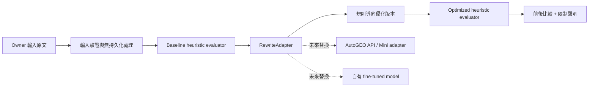

# GEO Workbench V1 架構

> **V1 成功定義：** 對相同輸入提供可重複的「原文、規則導向優化版本、比較指標與限制聲明」。V1 不宣稱改善 Google、ChatGPT 或其他生成式搜尋引擎的實際排名。

## 範圍與邊界

V1 是 owner-only 的私有 Workbench，不建立資料庫資料表、不寫入客戶資料、不執行訓練、不下載模型權重，也不啟用 production inference。使用者輸入只在單次 owner-authenticated request 的記憶體中處理；沒有持久化路徑。

既有 owner session 仍沿用專案的 `requireOwner`。這是既有私有管理邊界，並非 V1 新增的資料集、實驗 ledger 或客戶資料功能。

## 目錄結構

```text
nuxt-app/
├── server/
│   ├── api/geo/optimise.post.ts       # owner-only、無持久化 HTTP 邊界
│   └── geo/
│       ├── contracts.ts               # TypeScript 核心型別與 adapter interface
│       ├── rules.ts                   # 版本化、可審核的 GEO 規則
│       ├── metrics.ts                 # heuristic 前後比較，不代表外部排名
│       └── optimise.ts                # reference adapter 與 orchestration
├── pages/audit-lab/geo.vue            # owner-only Workbench UI
└── tests/geo-workbench.contract.test.ts

research/geo_workbench/
├── contracts.py                        # Python 同義資料契約
├── reference_adapter.py                # 合成 fixture 的無權重 reference flow
├── evaluate.py                         # 可重現的 heuristic 比較器
├── smoke.py                            # 本地 JSON smoke 入口
└── tests/test_contracts.py             # Python 標準函式庫測試
```

## 核心流程



## TypeScript 核心介面

| 介面 | 責任 | V1 實作 |
|---|---|---|
| `GeoRewriteAdapter` | 將文件與規則轉成候選優化版本 | `reference-rules-v1`，無外部模型或金鑰 |
| `GeoRule` | 記錄可版本化、可審核的優化約束 | 六條 AutoGEO-compatible heuristic 規則 |
| `evaluateDocument` | 對同一份 input 量化結構、可回答性、可掃讀性、證據與保留度 | deterministic heuristic evaluator |
| `optimiseGeoDocument` | 組合 baseline、rewrite、optimized evaluation 與比較結果 | 無資料庫 orchestration |

`GeoRewriteAdapter` 是未來接入 AutoGEO 的唯一替換點。任何外部 adapter 都必須回傳同一份 `GeoRewriteCandidate`，並明確標示 model/provider/version、rule set、限制與 provenance；不得把外部模型輸出直接宣稱為真實搜尋排名改善。

## Python 研究介面

Python 層保留與 TypeScript 同義的 `GeoDocument`、`GeoRule`、`RewriteCandidate` 與 `DocumentEvaluation`。它只支援標準函式庫 JSON smoke flow，適合後續將 AutoGEO 官方 repo 以隔離、固定版本的 research environment 掛接進來。V1 不複製 AutoGEO upstream 程式、不安裝其訓練相依、不呼叫付費模型，也不下載 checkpoint。

## AutoGEO 重用策略

AutoGEO 的公開方法啟發了 V1 的「可版本化規則 → rewrite adapter → baseline/optimized evaluation」分層。其官方 repo 與公開模型卡的授權、模型、訓練與評估研究摘要見 [AUTOGEO_BASELINE_RESEARCH.md](./AUTOGEO_BASELINE_RESEARCH.md)。

未來只有在下列條件完成後，才能增加 `autogeo-api` 或 `autogeo-mini` adapter：已確認 upstream 版本與授權、隔離 Python environment、批准的模型／引擎憑證、合法資料與評估集、可重現的效果衡量，以及 owner 批准。這些條件不屬於 V1 無資料庫 smoke flow。

## 後續資料庫接入順序

1. 維持 V1 純函式 core 的契約與測試不變。
2. 以明確批准的 migration 新增 only-append 實驗／artifact lineage repository。
3. 只將去識別化特徵、規則版本、模型版本、評估設定與測量結果寫入 ledger；不得直接複製客戶原文、姓名、電子郵件或公司資訊。
4. 以 frozen evaluation set 與人工審核 gate 比較 external adapter、自有 fine-tune 與 reference adapter。
5. 在可重現成效與治理審核完成後，才考慮 production inference 或客戶介面。
